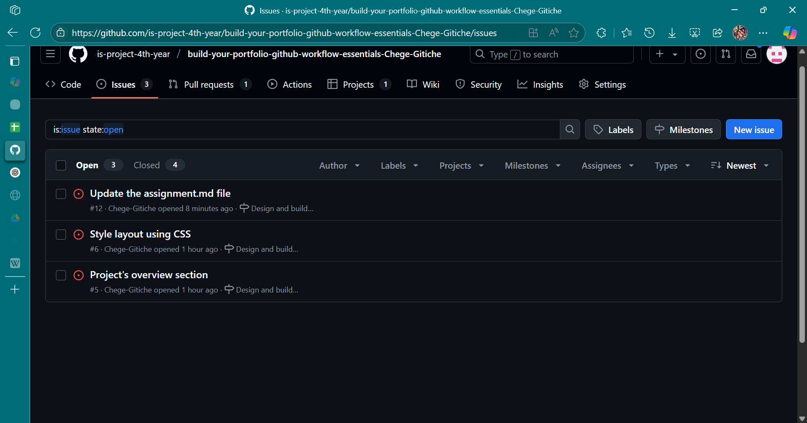
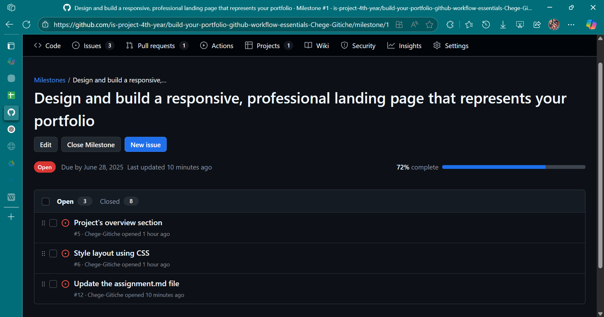
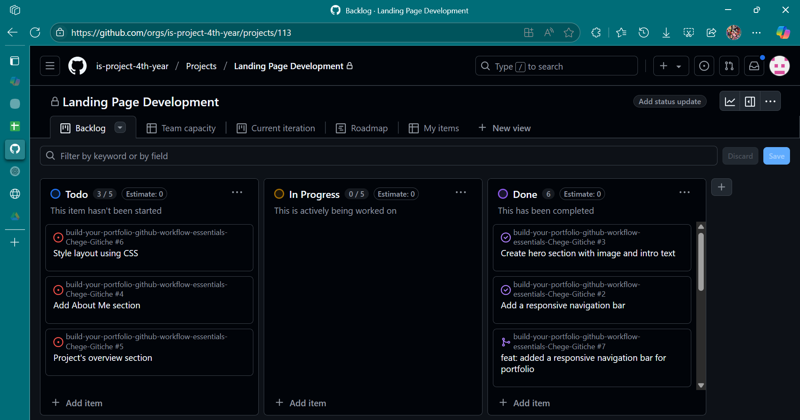
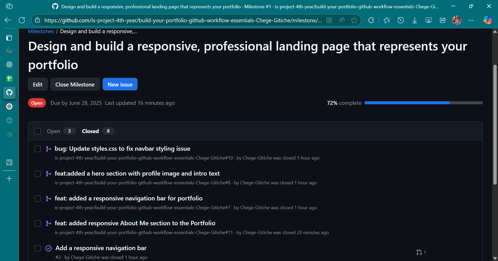
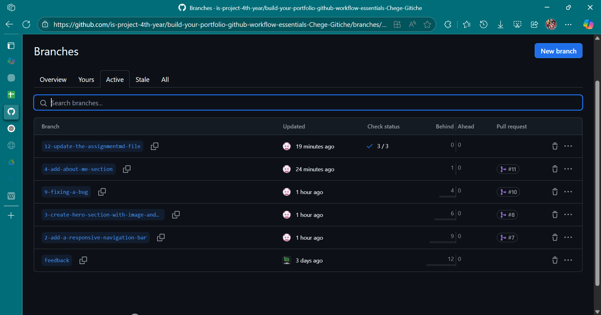
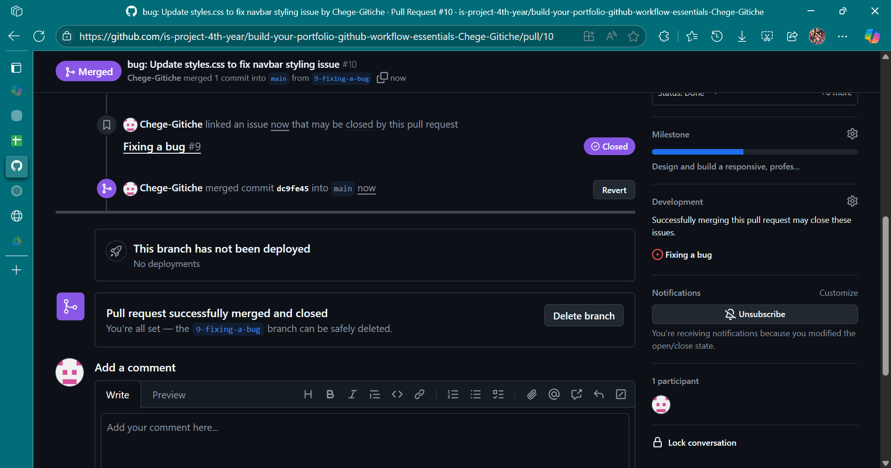

# Personal Portfolio Documentation

## 1. Student Details

- **Full Name**: Gitiche Emmanuel Chege
- **GitHub Username**: Chege-Gitiche
- **Email**: emmanuel.gitiche@strathmore.edu

## 2. Deployed Portfolio Link

- **GitHub Pages URL**: https://is-project-4th-year.github.io/build-your-portfolio-github-workflow-essentials-Chege-Gitiche/
  _(Provide the live link to your deployed portfolio website)_

## 3. Learnings from the Git Crash Program

List at least **four key concepts or skills** you learned during the Git crash course. For each one, write a brief explanation of how it helped you manage your portfolio project more effectively.

Example format:

- **Branching**: Helped me separate features and prevent conflicts when working on different sections of the site.
- _(Continue with other concepts…)_
- **Issues**: This has helped me in separating the different concerns of a project into small manageable chunks
- **Merge Conflict Resolution**:This has helped me in understanding how to efficiently bringing together different working features into one coherent project
- **Project Board**: This has helped me to easily manage projects and understand what has been done , what needs to be done and what is being done
- **Commits**: This has enabled me to make well informed commit messages that can easily be read and understood by both new and experienced people to a project
## 4. Screenshots of Key GitHub Features

Include screenshots that demonstrate how you used GitHub to manage your project. For each screenshot, write a short caption explaining what it shows.

> Upload the screenshots to your GitHub repository and reference them here using Markdown image syntax:
> (you could just simply copy and paste the image into the Assignment.md)

- This shows the Issues I've created to separate the issue into manageable bits

- This shows one of the key goals in the project

- This shows the project board that allows easy management of issues

### A. Milestones and Issues

- Screenshot showing your milestone(s) and the issues linked to it.

### B. Project Board

- Screenshot of your GitHub Project Board with issues organized into columns (e.g., To Do, In Progress, Done).

### C. Branching

- Screenshot showing your branch list with meaningful naming.

### D. Pull Requests

- Screenshot of a pull request that’s either open or merged and linked to a related issue.

### E. Merge Conflict Resolution

- Screenshot of a resolved merge conflict (in a pull request, commit history, or your local terminal/GitHub Desktop).

.png)
.png)
.png)